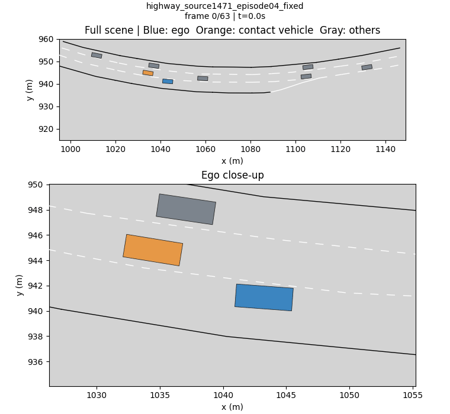
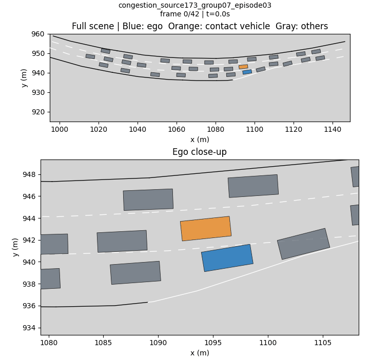

# HDG Scenario Generation

HDG traffic scenario generation and closed-loop ADS evaluation.

## Demo

<p>
  
  
</p>

## Set up

Install Conda and Git, then run the following commands from the project root:

```bash
conda env create -f environment.yml
conda activate HDG
python scripts/setup_pdm.py
python scripts/check_environment.py
```

## Quick start

### 1. Download the data

Download the datasets from [Google Drive](https://drive.google.com/drive/folders/1Rbteq_in0GCTQ1YpYWKOTEejnekWe4bF?usp=sharing).

**Highway**: Download `Track_dataset_smooth.pth` and place it at:

```text
data_process/python/processed_data/Track_dataset_smooth.pth
```

**Congestion**: Download `Track_dataset_congestion.pth` and place it at:

```text
data_process/python/processed_data/Track_dataset_congestion.pth
```

### 2. Assess risk and generate labels

**Highway**

```bash
python -m hdg.workflow prepare --dataset highway
```

**Congestion**

```bash
python -m hdg.workflow prepare --dataset congestion
```

This creates `outputs/hdg/highway/data.pt` and `outputs/hdg/congestion/data.pt`, containing trajectories, initial states, risk scores, and class labels.

### 3. Train the model

**Highway**

```bash
python -m hdg.workflow train --dataset highway
```

**Congestion**

```bash
python -m hdg.workflow train --dataset congestion
```

Models are saved in the `model/` subdirectory of each dataset's output directory. Closed-loop evaluation uses `best_temporal.pt` by default.

### 4. Run closed-loop evaluation

**Highway**

```bash
python -m hdg.workflow validate --dataset highway --initial-scenes 10 --batch-size 8
```

**Congestion**

```bash
python -m hdg.workflow validate --dataset congestion --initial-scenes 10 --batch-size 8
```

`--initial-scenes` specifies the number of initial scenes selected from real data. `--batch-size` specifies the number of joint trajectories generated per initial scene. Each command above runs `10×8=80` episodes.

Results are saved in `outputs/hdg/highway/closed_loop/` and `outputs/hdg/congestion/closed_loop/`. Metrics are printed in the terminal when evaluation finishes:

| File | Contents |
| --- | --- |
| `table2.json` | KCS, TTC mean and standard deviation, Coll., ACR, VARC, VARAF, VAFR |
| `metrics.md` | Metrics table |
| `group_XX/episode_XX.pt` | Closed-loop trajectories and evaluation results |
| `collision_demos/*.gif` | Animated replays of two randomly selected episodes (all episodes if fewer than two) |
| `collision_demos/index.html` | Interactive replay page with pause and seek controls |

To generate demos from saved results without rerunning closed-loop evaluation:

**Highway**

```bash
python -m hdg.collision_demo --results outputs/hdg/highway/closed_loop
```

**Congestion**

```bash
python -m hdg.collision_demo --results outputs/hdg/congestion/closed_loop
```

When changing the evaluation size, use `--results` to specify a new output directory:

**Highway**

```bash
python -m hdg.workflow validate --dataset highway --initial-scenes 5 --batch-size 16 \
  --results outputs/hdg/highway/validation_5x16
```

**Congestion**

```bash
python -m hdg.workflow validate --dataset congestion --initial-scenes 5 --batch-size 16 \
  --results outputs/hdg/congestion/validation_5x16
```

See `configs/hdg_experiment.json` for parameter settings.
